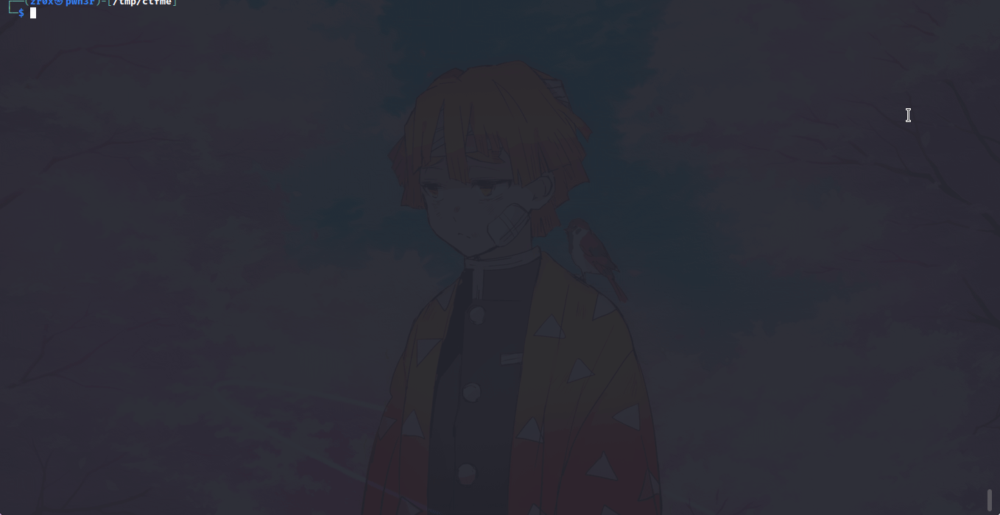

# CTFME - CTF Directory Creator

## Overview

This script automates the process of creating directories for Capture The Flag (CTF) challenges, along with corresponding note templates. It's designed to streamline the manual process of setting up challenge directories for CTF competitions.

## GIF



## Features

- Automatically creates directories for CTF challenges.
- Generates note templates for each challenge directory.
- Easy to use and customizable.

## Usage

```
Usage: ./ctfme.sh [OPTIONS]

Options:
  -h, --h, --help                  Display this help menu
  -l, --l <absolute/path>          Location for CTF directory
  -a, --a, --add <categories>      Add more category/categories
  -r, --r, --remove <categories>   Remove category/categories
  -d, --d, --default               If you have manually set location
  -n, --n, --note                  Creating note template
  -s, --s, --show                  Print the default category list 
```

## Installation

```bash
git clone https://github.com/Durge5h/DailyTasksAutomation.git
cd DailyTasksAutomation/ctfme
chmod +x ctfme.sh
./ctfme.sh exampleCTF -l /path/to/ctf/directory
```
> You can also create symbolic link of script so that can you can use it from anywhere in terminal if you do so make sure to change the path in scirpt i.e. `note_dir`

## Example

Here's an example of how to use the script:

```bash
./ctfme.sh exampleCTF -l /path/to/ctf/directory -a web3 -r steg -n
```

This command will create a CTF directory exampleCTF at the specified location (`/path/to/ctf/directory`), add the category `web3`, and remove the category `steg` from default array list and create note template within each category of challenges.

```bash
./ctfme.sh exampleCTF --default
```

This command will create a CTF directory exampleCTF at the specified location specified within script by default and furthere more you can use all swithces as well.

---

Feel free to further customize the content as needed!
